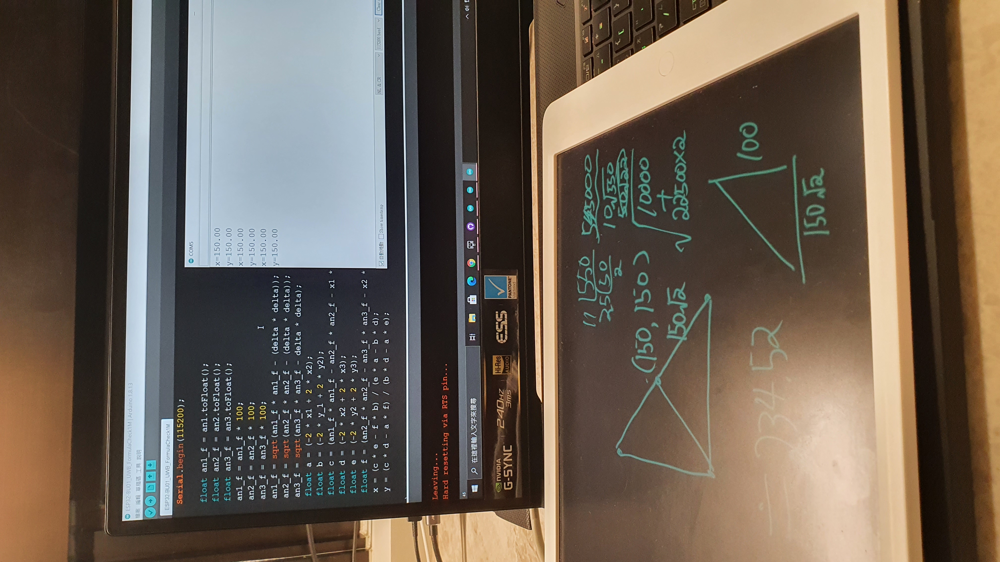
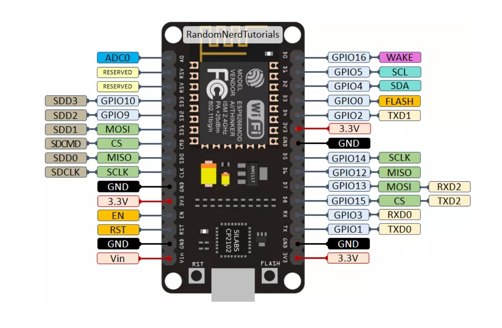

# UWB_Robot-X

```
ProjectStartYear: 2021  
Author: SeanChang
```


##  Problem and Solution  
>### -2021.02.05-  
>○問題:  開始測距後，無法寫入（Serial.read()）  
>
>○判斷:  厘清問題後，猜測是“使用計時器傳送檔案”所造成之問題，通常不會應該這樣寫，所以接下來我將嘗試寫換成“計次傳送”的方法（例如:每1000筆傳送一次才不會造成刷屏的現象），不過這應不影響最終測距結果，只是顯示出來會更方便做判斷。  

○相關檔案:  [ESP32-BU01_UWB_Read.ino](firmware/ESP32/ESP32-BU01_UWB_Read/ESP32-BU01_UWB_Read.ino)  


##  
>### -2021.02.26-  
>○今日進度:  已將三點定位公式程式化，並成功測試其運作狀況(運用GeoGebra繪製模擬圖並驗證其準確度)  
>
>○問題:  
>>1)  繼上次計時器問題，這次嘗試將計時器替換成計數器，但其無法寫入（Serial.read()）的問題仍無法解決，但我認為這並不是太大的問題，因為透過BU01重置即可結束測距並恢復初始狀態。  
>>2)  **[自我提醒] 在定義座標變數時，我定義的y1變數出現"'double y1' redeclared as different kind of symbol"的問題，我想是與ESP32開發版本身定義的變數有所衝突，所以更換為y_1即可解決。**  
>
>○判斷:  
>>1)  接下來我應開始查詢有關RST腳位相關的資訊，因為曾經在使用USB_Host_Shield_2.0做手把控制時有印象因為其本身無reset鈕，所以會將ESP8266的RST腳位與其RST腳位相連即可同時重置，希望能使用BU01的RST嘗試看看。  而且這個功能僅是為顯示出數值而已，方便除錯，並不會對變數本身產生影響，所以我決定暫且使用定時器就好，不應耽誤其進度，希望在未來精修階段再做最終處理。  

○相關檔案:  [ESP32-BU01_UWB_FormulaTest.ino](firmware/ESP32/ESP32-BU01_UWB_FormulaTest/ESP32-BU01_UWB_FormulaTest.ino)  

  
  
  


##  
>### -2021.02.27-  
>○假日記錄: 今天是二二八連假第一天，在空閑之餘，我突然產生一種想法。一開始使用的MCU為ESP32是考量到功能支援與運算速度的問題，但在一開始其實我寫了兩個程式，一個拿ESP32當中繼另一個是拿ESP8266，其實都可以，但是ESP8266是模擬出來的RX/TX，不太確定之後其中可能產生什麽技術上的問題 **[提醒]模擬的RX/TX與原生的差別？**。  
>
>○之後計劃:  我可能會做兩種版本兼容ESP32及ESP8266，應該會先從ESP8266開始做Prototype是因爲先前我已有之前做的[MBT-Mini_Battlebot_2020](https://github.com/SeanChangX/MBT-Mini_Battlebot_2020)車體，所以可提高一點效率，在測試之後再做修改。  
>
>○特殊現象:  （Serial.read()）之問題消失了可以正常停止測距，暫時不知原因。(2021.02.28臨時更新:我想問題應是出在AT命令本質上輸錯了，可能是之前我動到了我提前預置在序列埠程式中的AT命令格式，**遺漏了[\r\n]**，所以等於其實只是沒收到正確的命令，所以之前產生的假設都可以廢除了，同時也可以**由此推論: 當初想做AT ON/OFF無法讀取的原因也可能是因爲遺漏後方的訊息**)  

○相關檔案:  [ESP32_UWB_Serial.ino](firmware/ESP32_UWB_Serial/ESP32_UWB_Serial.ino)   |   [ESP8266_UWB_Serial.ino](firmware/ESP8266_UWB_Serial/ESP8266_UWB_Serial.ino)  


##  
>### -2021.03.05-  
>○今日進度:  
>>1)  成功將BU01測距數值轉換至實際坐標系中，程式編譯無錯誤，但還未實際測試其輸出之(x,y)是否正確。  
>>2)  將序列埠輸出數值顯示至串口調試助手中的波形顯示中，方便日後更直觀的DEBUG。  

```C#
void sendDATA () {
  Serial.println(an1 + " - " + an2 + " - " + an3);
  Serial.println("an1=" + an1 + "," + "an2=" + an2 + "," + "an3=" + an3);
}
```

>○問題與解決方法:  
>>1)  繼上次完成純數學方程的程式化後，今天將他放入了[ESP32-BU01_UWB_001.ino](firmware/ESP32/ESP32-BU01_UWB_001/ESP32-BU01_UWB_001.ino)中，並在計算中加入了當時沒加入考慮的UWB Station高度數據(離地一米，降低UWB誤差)，得以獲得真正的坐標數據。但在進行String To Float的時候出現了一個狀況，就是我嘗試使用了 **.toFloat()**但是失敗了，而且其錯誤訊息疑似是有關**物件導向的運算子超載
(Operator Overloading)**，但是目前我還為接觸過這個所以轉向測試了**atof()**，卻也同樣出現了錯誤，後來爬文得知疑似這個function只適用於char。最後我只好再次觀察並改寫成如下所示的樣子，就奇跡般的成功了，但是雖然解決了問題，卻未完全搞清楚其中原因，希望日後可以再深一步確認其成因。
```C#
//.toFloat()  [1st]
  float an1_f;
  float an1_f;
  float an1_f;
  an1_f = an1.toFloat();
  an2_f = an2.toFloat();
  an3_f = an3.toFloat();
//.toFloat()  [2nd]
  float an1_f = an1.toFloat();
  float an2_f = an2.toFloat();
  float an3_f = an3.toFloat();
//atof()
  float an1_f = atof(an1);
  float an2_f = atof(an2);
  float an3_f = atof(an3);
```

○相關檔案:  [ESP32-BU01_UWB_Read.ino](firmware/ESP32/ESP32-BU01_UWB_Read/ESP32-BU01_UWB_Read.ino)   |   [ESP32-BU01_UWB_001.ino](firmware/ESP32/ESP32-BU01_UWB_001/ESP32-BU01_UWB_001.ino)  


##  
>### -2021.04.23-  
>○今日進度:  
>>1)  重新確認定位公式，發現之前意外留下的錯誤。  
>>2)  更換測試車體，確保所使用之開發板固定確實，並參考Datasheet嘗試將BU01采平躺方式固定(試驗中)。  
>>3)  已可以無綫控制，用（_18650串聯 | 7.4V-8.4V_）電池供電給L298N馬達驅動板，其馬驅 _5V-OUTPUT_ → ESP32，_ESP32-3.3V_ → BU01，使用BluetoothSerial回傳數據監控。  
>
-反推距離代入驗算-  
  

更換前 | 更換後
:---:|:---:
 |   

-DWM1000 Datasheet Page.15-  
  

>○問題與解決方法:  
>>1)  找到之前未將高度差平方，並將其替換為變數方便日後校正方便。  
```C#
  an1_f = sqrt(an1_f * an1_f - 100);
  an2_f = sqrt(an2_f * an2_f - 100);
  an3_f = sqrt(an3_f * an3_f - 100);
```
```C#
  //更換為deltaΔ 代表基站（anchor）與標簽（tag）的垂直高度差
  float delta = 90;     //CM
  ...
  an1_f = sqrt(an1_f * an1_f - delta * delta);
  an2_f = sqrt(an2_f * an2_f - delta * delta);
  an3_f = sqrt(an3_f * an3_f - delta * delta);
```
>>2)  在實測中發現其準確度會隨停留時間越趨於準確，而且其刷新速率不是很理想。再者，為實現轉向功能，將使用**加速度傳感器**，一旦如此，我一開始設計的AT控制可能受到MCU的設計框架限制，所以下一步將會研究**SPI**或**I2C**接口的工作原理及應用，看看是否可解決問題。  

>○下次任務:  
>>1)  使用有關DWM1000的Libraries進行測試。  
>>>● [thotro/arduino-dw1000](https://github.com/thotro/arduino-dw1000)  
>>>● [lewisxhe/arduino-dw1000-ng](https://github.com/lewisxhe/arduino-dw1000-ng)  

○相關檔案:  [ESP32-BU01_UWB_FormulaCheck1M.ino](firmware/ESP32/ESP32-BU01_UWB_FormulaCheck1M/ESP32-BU01_UWB_FormulaCheck1M.ino) | [ESP32-BU01_UWB_002.ino](firmware/ESP32/ESP32-BU01_UWB_002/ESP32-BU01_UWB_002.ino)  


------

## Data sheet
> ● [BU01](docs/datasheets/nodemcu-bu01.pdf)  
  ● [DWM1000](docs/datasheets/dwm1000-datasheet-1.pdf)  
  ● [DW1000](docs/datasheets/dw1000-datasheet-v2.09.pdf) | [USER_Manual](docs/datasheets/dw1000_user_manual_v2.15.pdf)  

  

>1.DWM1000是基於DW1000所開發的模組，所以其多出的字母M代表Module  
>2.


------

## Pinout Data
  
  



------

## Data Source
>MATHEMATICS: https://math.stackexchange.com/questions/884807/find-x-location-using-3-known-x-y-location-using-trilateration?fbclid=IwAR0-ItWKvf_oIQb9h2dPdxvq0jh5Q0_adl6m6USx5nw01NzVlef1XaJ_v0o  

>安信可 UWB模組專題: https://docs.ai-thinker.com/uwb  

